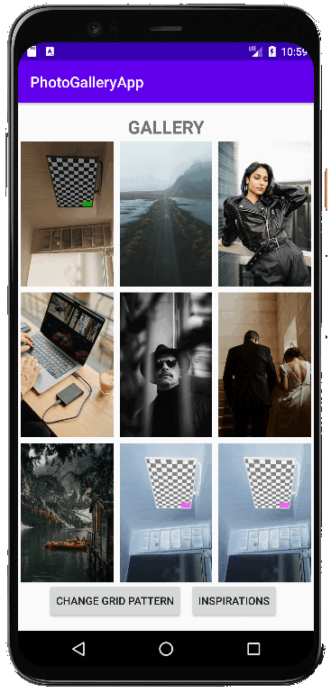
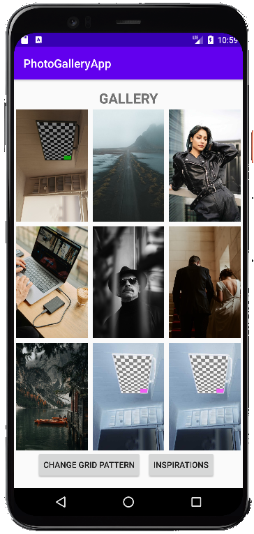
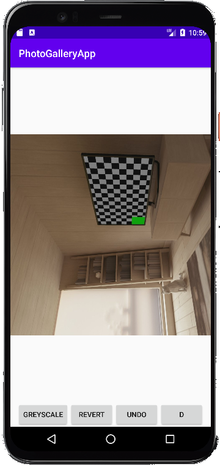
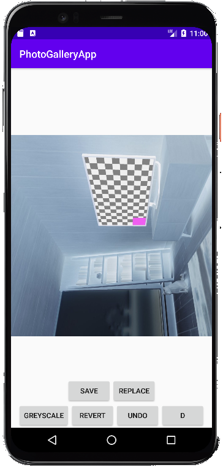
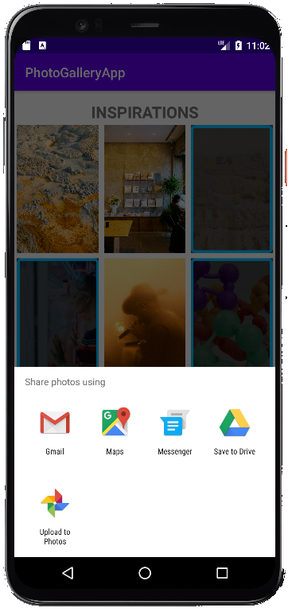
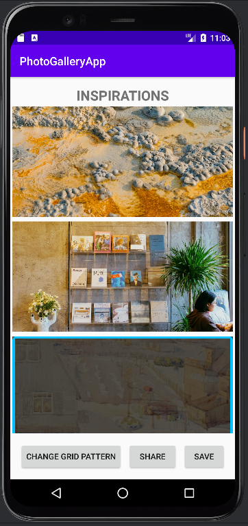

# CITB635-Android-Programming
Проект: Програмиране за мобилни устройства

# 📸 Gallery App – Manage, Edit & Share Your Photos!  

A versatile Android app for browsing, editing, and sharing photos. Supports local gallery management, photo effects, and inspirational images from Unsplash!  

## ✨ Features  

### 📂 **Local Gallery Management**  
✅ Browse & view images from your device  
✅ Select & manage multiple images  
✅ Customize grid layout (1x1 to 5x5)

### 🎨 **Photo Editing**  
Apply **grayscale** & **invert colors**  
Undo changes & reset to the original  
Save edits or replace the original image

### 🌍 **Inspirational Photos**  
Fetch **high-quality images** from Unsplash  
Save & share inspirational photos  
Toggle **grid & list views**  

